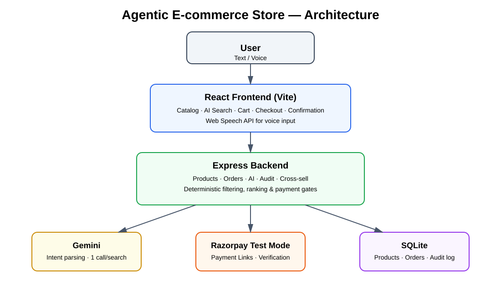
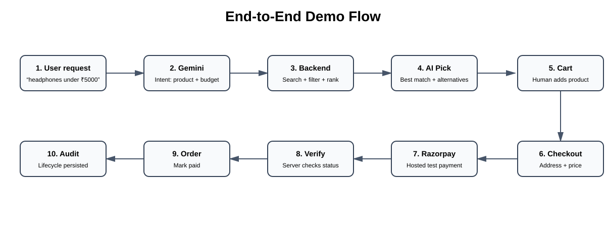
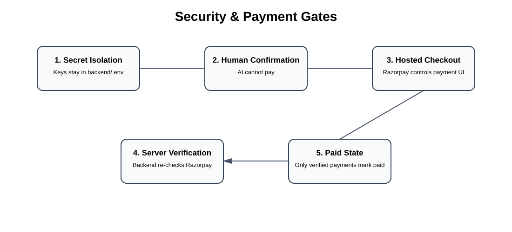
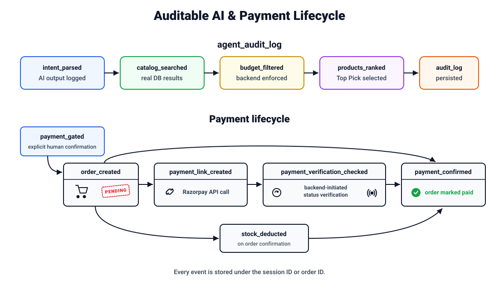

# Agentic E-commerce Store

**Razorpay AI Buildathon 2026 — Track 1: AI Growth & Agentic Commerce**

A working prototype demonstrating agentic commerce: an AI agent that understands natural-language shopping requests (text or voice), searches and ranks a live product catalog, and hands off to a real Razorpay test-mode payment flow — with every decision logged, every action bounded, and payment gated behind explicit human confirmation.

---

## What this is

A full-stack e-commerce store with two ways to shop:

1. **Manual** — browse, add to cart, checkout, pay. A normal e-commerce flow.
2. **AI-assisted** — type or speak a request like *"find headphones under ₹5000"*. The agent parses intent, searches the real catalog, ranks results, and shows a **Top Pick** plus alternatives — with over-budget items shown transparently rather than hidden.

Both paths converge on the same cart, checkout, and payment logic. The AI never touches money directly — it can only help you find products faster.

## Why this matters for this track

The track's bar is explicit: *"Every money action explainable, bounded and gated. Show the audit trail and one failure handled gracefully."* This build addresses each directly:

| Requirement | How it's met |
|---|---|
| **Explainable** | Every AI decision (intent parsed → catalog searched → budget filtered → ranked) is shown to the user and logged with real input/output data. |
| **Bounded** | The AI agent is read-only with respect to money — it can search and rank, but cannot add to cart, checkout, or trigger payment. Budget limits are enforced in backend code, never trusted from the AI's own output. |
| **Gated** | Payment can only be completed by a human, on Razorpay's own hosted checkout page, with the backend independently re-verifying payment status with Razorpay before ever marking an order paid. |
| **Audit trail** | Every AI reasoning step and every payment lifecycle event is persisted to a structured `agent_audit_log` table, queryable via API. |
| **Graceful failure** | Over-budget requests, no-match searches, and unclear/off-topic input are all handled with clear messaging — never a crash or a blank screen. |

## Demo flow

```
User: "find headphones under 5000" (typed or spoken)
  → Agent parses intent (1 Gemini API call)
  → Backend searches catalog, filters by budget, ranks by rating
  → Grid narrows to show matches: best option highlighted as "AI Pick",
    others as alternatives, any over-budget option shown dimmed and
    struck through — never hidden
  → User adds the pick to cart
  → A lightweight cross-sell suggestion appears: 1-2 related, in-stock
    products from the same category ("Complete your setup") — a manual
    click away, never auto-added
  → User checks out (address form, price breakdown)
  → Backend creates a real Razorpay Test Mode Payment Link
  → User completes payment on Razorpay's own hosted page
  → Backend independently verifies payment status with Razorpay
  → Order confirmed only once Razorpay confirms — never before
```

---

## Architecture



**Key design decision:** the AI is used for exactly one thing — understanding what the user wants, in exactly one API call per search. It returns `{ productName, budget }`. Everything after that — searching, filtering by budget, ranking by rating, deciding the Top Pick — is deterministic backend code. The AI never sees or touches cart, checkout, or payment logic, and it never decides what counts as "affordable" — that's a hard-coded comparison against real database prices.

### Backend endpoints

| Method | Path | Purpose |
|---|---|---|
| `GET` | `/api/products` | List/search catalog (supports `?search=`, `?category=`) |
| `GET` | `/api/products/:id` | Single product |
| `GET` | `/api/products/:id/related` | Cross-sell suggestions (same category, in stock, top rated) |
| `POST` | `/api/orders` | Create a pending order (stock validated, not yet deducted) |
| `GET` | `/api/orders/:id` | Fetch an order |
| `POST` | `/api/orders/:id/create-payment` | Create a real Razorpay Test Mode Payment Link |
| `POST` | `/api/orders/:id/verify-payment` | Server-side re-verification with Razorpay; only this can mark an order paid |
| `POST` | `/api/orders/:id/cancel-payment` | Cancel an active payment link |
| `POST` | `/api/ai/search` | The agent endpoint — one Gemini call, then deterministic search/rank |
| `GET` | `/api/audit` | Most recent audit log entries |
| `GET` | `/api/audit/:sessionId` | Full audit trail for one AI search session or one order |

### End-to-end demo flow



### Security & payment gates



### Database schema

```sql
products (id, name, brand, category, price, stock, rating, discount)

orders (id, user_id, total_amount, status, customer_name, address_line,
        city, pincode, phone_number, created_at,
        razorpay_payment_link_id, razorpay_payment_link_url,
        razorpay_payment_link_expires_at)

order_items (id, order_id, product_id, quantity, price_at_purchase)

agent_audit_log (id, session_id, event_type, input, output, timestamp)
```

`status` transitions: `pending` → `paid` (only after Razorpay confirms) — or `cancelled` / `expired`.

### The audit trail in practice



Every AI search writes a chain of events under one `session_id`:

```
intent_parsed → catalog_searched → budget_filtered → products_ranked
```

(or `unclear_request` / `no_match_found` where applicable)

Every order's payment lifecycle writes a chain under the order's own ID:

```
order_created → payment_link_created → payment_verification_checked → payment_confirmed
```

Cross-sell suggestions are also logged (`cross_sell_suggested`), so growth-oriented reasoning is traceable too, not just search and payment.

Query either directly:

```bash
curl http://localhost:3000/api/audit
curl http://localhost:3000/api/audit/<session-id-or-order-id>
```

---

## Running it

**Requirements:** Docker and Docker Compose.

```bash
git clone <this-repo>
cd razorpay-buildathon
cp backend/.env.example backend/.env
```

Edit `backend/.env` with your own test-mode credentials:

- `GEMINI_API_KEY` — from [Google AI Studio](https://aistudio.google.com/) (free tier)
- `RAZORPAY_KEY_ID` / `RAZORPAY_KEY_SECRET` — from the [Razorpay Dashboard](https://dashboard.razorpay.com/), Test Mode

```bash
docker-compose up -d --build
```

- Frontend: [http://localhost:5173](http://localhost:5173)
- Backend: [http://localhost:3000](http://localhost:3000)

The SQLite database is created and seeded automatically on first run.

> Frontend code isn't volume-mounted in this Docker setup — after editing frontend source, re-run `docker-compose up -d --build` to see changes.

### Testing a payment

Use Razorpay's [test card details](https://razorpay.com/docs/payments/payments/test-card-upi-details/) on the hosted checkout page — no real money moves.

### Running tests

```bash
cd backend
npm test
```

9/9 tests passing — covers the product API, order creation and stock limits, and payment verification edge cases.

---

## Security

- API keys (`GEMINI_API_KEY`, `RAZORPAY_KEY_ID`, `RAZORPAY_KEY_SECRET`) live only in `backend/.env`, are never referenced anywhere in frontend code, and `.env` is git-ignored — verified never committed to history.
- Payment status is determined **exclusively** server-side, by the backend independently querying Razorpay's API — the frontend cannot spoof a successful payment.
- All error responses are sanitized: internal errors (database failures, etc.) are logged server-side via `console.error` and returned to the client as generic, safe messages (e.g. `{"error": "Failed to retrieve order"}`) — never raw stack traces, SQL errors, or file paths.

## Known limitations

Being transparent about what this prototype intentionally does not solve, given the timeframe:

- **No real authentication.** A single hardcoded demo user is used throughout — there are no accounts or login. As a direct consequence, `GET /api/orders/:id` has no ownership check; anyone with a specific order ID could view that order's details. Acceptable for a single-user demo; would require real auth in production.
- **No frontend state persistence.** This is a client-side React SPA with in-memory state — refreshing the browser mid-checkout clears the cart.
- **Agent is search/rank only.** It does not (yet) add items to cart, adjust quantities, or fill in checkout details autonomously — every cart and checkout action is a deliberate human click, by design, to keep the "gated" requirement unambiguous.
- **Cross-sell is deterministic, not AI-driven.** Suggestions are same-category, in-stock, highest-rated matches — a simple SQL lookup, intentionally not a second Gemini call, to keep the agent's API usage predictable and free-tier-friendly.

## What's next, given more time

- Agent-assisted cart actions ("add two of the top pick"), still behind explicit confirmation
- Webhook-based payment confirmation (current implementation uses manual/polled verification, since local development has no public callback URL)
- A simple audit trail viewer UI (the data already exists and is queryable — this would just visualize it)
- Real user accounts and order ownership checks

---

## Tech stack

**Backend:** Node.js, Express, SQLite, Razorpay Node SDK, `@google/genai` (Gemini)
**Frontend:** React (Vite), Web Speech API for voice input
**Testing:** Jest, Supertest
**Infra:** Docker, Docker Compose
